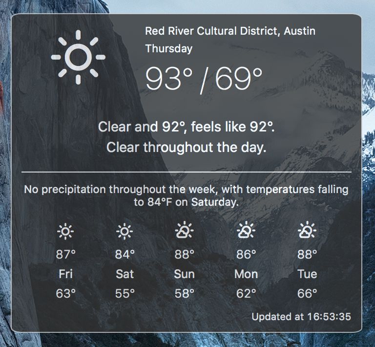

# Weather Forcast Widget
Made for [Übersicht][u]

  [u]: http://tracesof.net/uebersicht/

## Notes

`weather.conf` is the config file where your forecast.io API key and, optionally, your Google
geocoding API key live. Rename the example config and replace the values with your own API keys.

 * [Forecast.io API key][fapi]
 * [Google Geocoding API key][gapi]

  [fapi]: https://developer.forecast.io.
  [gapi]: https://developers.google.com/maps/documentation/geocoding/?csw=1#api_key

### Location Auto-detection

If you install the [`whereami` script][w], you can automatically get your latitude and longitude to use
when fetching weather. The location of this script is configured in `index.coffee`.

  [w]: https://github.com/robmathers/WhereAmI

If need to enter your latitude and longitude coordinates in `index.coffee`, which you can find
using [Google Maps][gm].

  [gm]: https://www.google.com/maps

### Reverse Geocoding

If you use location auto-detection, it's useful to print the location name in the weather summary.
The [Google Geocoding API][geocode] is used to determine a place name from the given latitude and
longitude coordinates. If you do not wish to use this feature or you do not have a geocoding API
key, you can omit the `--geocode` option from the command in `index.coffee`.

  [geocode]: https://developers.google.com/maps/documentation/geocoding/

## Credits

Icons by [Erik Flowers][ef].

  [ef]: http://erikflowers.github.io/weather-icons/

Based heavily on the [original widget][o] by [Felix Hageloh][fh].

  [o]: https://github.com/felixhageloh/weather-widget
  [fh]: http://tracesof.net/
